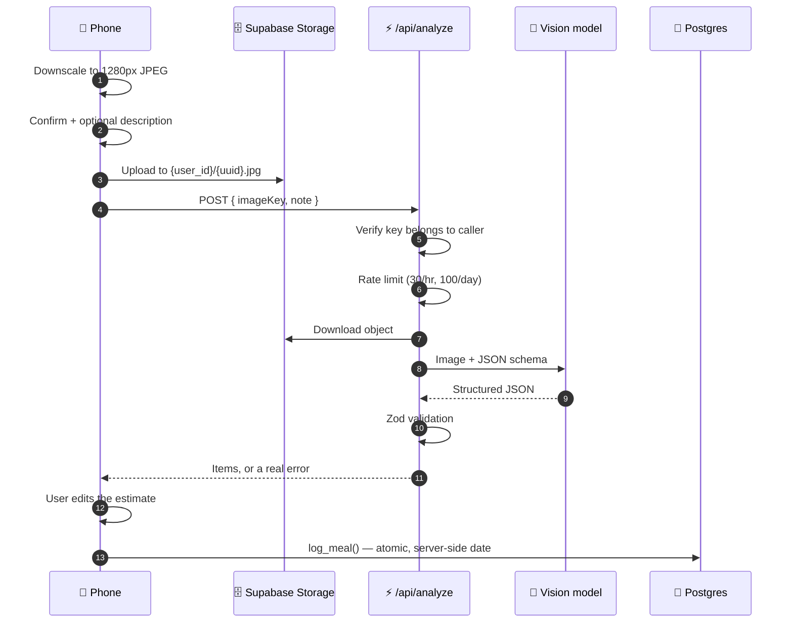
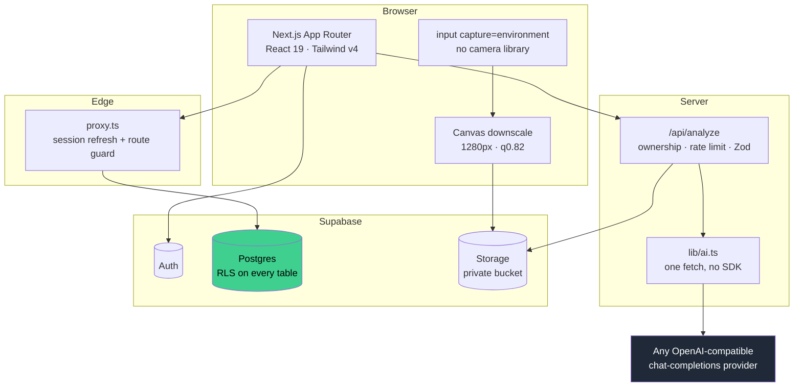
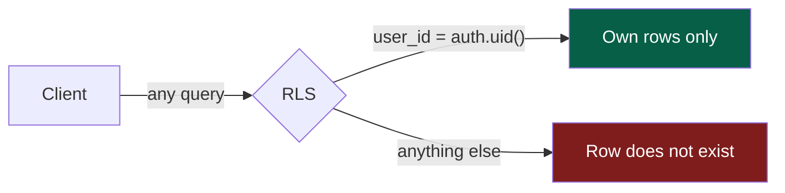

<div align="center">


# Kcalup

**Photograph your plate. Get calories in under 15 seconds.**

A mobile-first food log that replaces searching a database with pointing a camera.

[**Live app →**](https://kcalup.maansi.fyi)


</div>

---

## Demo

<div align="center">

<!--
  ADD THE DEMO VIDEO HERE.
  Easiest route: open a new GitHub issue in this repo, drag the .mp4 or .gif into
  the comment box, copy the URL GitHub generates, and paste it below as:

      https://github.com/user-attachments/assets/<id>

  A bare URL on its own line renders as an inline player. Do NOT wrap it in
  markdown image syntax — that only works for GIFs, not MP4.
  Keep it under ~30s: open app → tap Add food → shoot a plate → review → logged.
-->

**[▶ Try it live](https://kcalup.maansi.fyi)** · install it to your home screen and it behaves like a native app

</div>

---

## What it does

|  | |
|---|---|
| 📸 **One tap to log** | Camera opens straight from the tab bar. Shoot, confirm, done. |
| 🧠 **Vision model reads the plate** | Every distinct food is identified and estimated separately — a burger and its fries are two rows. |
| ✍️ **You are the final say** | Estimates land in an editable sheet. Tap any number to correct it before saving. |
| 💬 **Hint when the photo can't tell** | Optional description catches what a camera cannot see: a brand, a hidden ingredient, what it was cooked in. |
| 🖼️ **Visual food log** | Your photos come back as thumbnails in the day list and full size on each meal. |
| 📊 **Goals and macros** | Daily calorie target, optional protein/carb/fat goals, 30-day history. |
| 🔒 **Authorization in Postgres** | Row Level Security, not app code. Proven by a test, not asserted. |
| 📱 **Installable** | Web app manifest, no service worker, no app store. |

---

## How a photo becomes a meal



**Nothing is uploaded until you press Analyse.** A bad shot costs no storage and no AI call.

<details>
<summary><b>Why the image passes through the API route</b></summary>

<br>

The original design handed the model a signed URL so the image never touched our compute. That broke: Gemini's OpenAI-compatible endpoint accepts `data:` URIs only and rejects a remote URL with a bare `400`.

So the route downloads the object and inlines it as base64. Because the browser has already downscaled to a 1280px long edge, that's a few hundred KB — not the original camera file. The 8 MB upload limit is still avoided entirely, since the phone uploads to storage directly.

</details>

<details>
<summary><b>Why structured output instead of tool calling</b></summary>

<br>

With a tool/function definition, `gemini-3.5-flash-lite` ignored the nested item schema and returned `{"items": ["Hamburger"]}` — an array of strings. Zod rejected it and the user saw a failure. It wasn't even deterministic: an identical retry returned proper objects.

`response_format: { type: "json_schema" }` is *enforced* where a function definition is only *suggested*. Switching removed the tool definition, the tool-call extraction, and the whole class of bug.

</details>

---

## Architecture



The provider is one `fetch` in a single file. No vendor SDK, because one POST and one JSON parse do not need a dependency — and the SDK that was going to be the abstraction turned out to speak the wrong endpoint.

---

## Quickstart

```bash
git clone https://github.com/MaansiBisht/kcalup.git
cd kcalup
npm install
cp .env.example .env.local    # fill in the values below
npm run dev
```

### Environment

| Variable | What it is |
|---|---|
| `NEXT_PUBLIC_SUPABASE_URL` | Supabase project URL |
| `NEXT_PUBLIC_SUPABASE_ANON_KEY` | Supabase publishable / anon key |
| `AI_API_KEY` | Provider key — **server-only**, never prefix with `NEXT_PUBLIC_` |
| `AI_BASE_URL` | Any OpenAI-compatible base, e.g. `https://generativelanguage.googleapis.com/v1beta/openai` |
| `AI_MODEL` | e.g. `gemini-3.5-flash-lite` |

<details>
<summary><b>Choosing a provider</b></summary>

<br>

Anything speaking OpenAI `chat/completions` with image input and `response_format: json_schema` works. Swapping is three environment variables.

**Gemini free tier** is the default in `.env.example`. Vision is free of charge on the Flash models — key from [aistudio.google.com/apikey](https://aistudio.google.com/apikey).

**Command Code**, verified against the live API on 2026-08-31:
- The API splits by *request shape*: `/v1/messages` takes the Anthropic schema but serves **Claude models only**. Every OpenAI and open-source model — MiniMax included — is on `/v1/chat/completions`.
- Model ids are namespaced: `minimax/minimax-m3-free`, not `minimax-m3-free`. `GET /v1/models` lists them.
- The **Go plan has no API access at all** — both endpoints return `403 upgrade_required`. Provider plan or higher is required. The `-free` models cost no credits but still need a plan that can reach the endpoint.

</details>

### Database

Run the migrations in order against your Supabase project (SQL editor or `supabase db push`):

1. **`0001_init.sql`** — tables, RLS policies, the signup trigger, the `log_meal` function
2. **`0002_storage.sql`** — the private `meal-images` bucket and its per-user path policies

Then in **Authentication → URL Configuration**, set your Site URL and add `<your-domain>/auth/callback` to the redirect allow-list, or confirmation and password-reset links will break.

> [!IMPORTANT]
> Supabase's built-in mailer is rate-limited to a handful of messages and is not for production. Configure custom SMTP before real users sign up.

---

## Security model

Authorization lives in Postgres, not in application code.



- **Every table** carries `using (user_id = auth.uid())`. A client cannot send a `user_id` that works — there is a test that tries.
- **`food_items`** inherits ownership through its meal; **`storage.objects`** through the `{user_id}/` path prefix.
- **`/api/analyze`** rejects any `imageKey` not under the caller's own folder, so a valid session cannot analyse someone else's upload.
- **`local_date`** is computed server-side inside `log_meal` from the profile's timezone. The client never sends a date.
- **Rate limits** of 30 analyses/hour and 100/day per user, counted from `ai_calls`. The daily cap is what protects the balance from a stuck retry loop.
- **Photo filenames** are random UUIDs, never the original filename, which leaks device details.

---

## Testing

```bash
npm test           # 37 unit tests — pure logic, no network
npm run typecheck  # tsc --noEmit
npm run lint       # eslint
npm run eval       # scores calorie accuracy against labelled photos
```

<details>
<summary><b>The accuracy harness — why prompt changes are measurable here</b></summary>

<br>

Prompt engineering without measurement is guesswork. `tests/accuracy.eval.test.ts` runs the *real* prompt and schema against labelled photos and scores median and worst-case error on total kcal. A schema failure counts as an accuracy failure, because the user sees nothing either way.

```bash
# tests/fixtures/cases.json
[{ "image": "burger.jpg", "kcal": 750, "expect": ["burger", "fries"] }]
```

Drop photos whose calories you actually know into `tests/fixtures/`, label them, and run `npm run eval`. It skips itself when `AI_API_KEY` is unset, so CI stays free.

</details>

<details>
<summary><b>The RLS test — the one that proves the security model</b></summary>

<br>

RLS is enforced by Postgres and cannot be unit tested. `tests/rls.test.ts` signs in as two real users and checks that B cannot read or delete A's meal, and that a forged `user_id` on insert is rejected. It skips unless pointed at a database:

```bash
RLS_TEST_URL=... RLS_TEST_ANON_KEY=... \
RLS_TEST_USER_A_EMAIL=... RLS_TEST_USER_A_PASSWORD=... \
RLS_TEST_USER_B_EMAIL=... RLS_TEST_USER_B_PASSWORD=... npm test
```

</details>

---

## Project structure

<details>
<summary><b>Expand</b></summary>

<br>

```
src/
├── app/
│   ├── page.tsx              # today — calories, capture, meals, macros
│   ├── day/[date]/           # any past day
│   ├── history/              # last 30 days
│   ├── meal/[id]/            # one meal: photo, macros, delete
│   ├── account/              # goals, timezone, sign out, delete account
│   ├── onboarding/           # one screen, one required number
│   ├── login/                # sign in / sign up / reset
│   ├── auth/callback/        # trades Supabase's code for a session
│   ├── api/analyze/          # the only server route
│   └── manifest.ts           # installability
├── components/
│   ├── PhotoCapture.tsx      # capture → confirm → analyse
│   ├── ReviewSheet.tsx       # editable estimate before saving
│   ├── MealList.tsx          # photo thumbnails
│   └── ...
├── lib/
│   ├── ai.ts                 # the only file that names a provider
│   ├── analysis.ts           # schema, prompt, response parsing
│   ├── day.ts                # profile + day queries
│   ├── image.ts              # validation + canvas downscale
│   └── date.ts               # timezone-correct local dates
└── proxy.ts                  # session refresh + route guard

supabase/migrations/          # schema, RLS, log_meal, storage policies
tests/                        # unit · RLS · accuracy eval
```

</details>

---

## Deployment

Push to `main` and Vercel deploys. Set the five environment variables in the project settings — `AI_API_KEY` must stay server-only.

For a custom domain behind Cloudflare, keep the record **DNS-only (grey cloud)**: proxying in front of Vercel stacks two CDNs and interferes with certificate issuance.

---

## Design

Tokens live in `@theme` in `src/app/globals.css`, so components stay pure Tailwind utilities — `bg-forest`, `rounded-card`, `text-muted` — with no hand-written CSS.

Installability comes from the manifest alone; there is no service worker, because installability does not need one. Android Chrome gets a long-press "Add food" shortcut. iOS Safari installs standalone but ignores `shortcuts`, so it's one tap from the icon to the camera.

---

## Roadmap

- [ ] Custom SMTP so signup emails survive real traffic
- [ ] Barcode scanning for packaged food
- [ ] Weekly trends and averages
- [ ] Re-analyse with a hint when the first pass gets it wrong
- [ ] Export to CSV

---

<div align="center">
<sub>Built with a camera, a vision model, and a database that says no.</sub>
</div>
